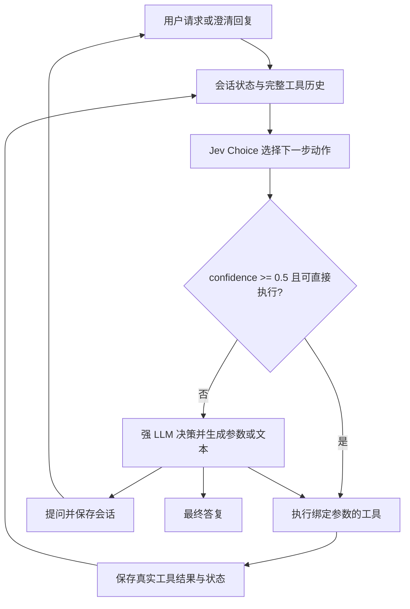

# REFLEX Baseline Agent and Experiments (0.3)

## 当前仓库入口（2026-10-08）

这是 REFLEX/Jev 的独立工程实现，包含 Agent、实验管线、V2 评测器和本地 Web 审核工作台，不是作者开源代码，也不代表完成论文复现。

- Web 功能、启动及审核说明：[WORKBENCH_README.md](WORKBENCH_README.md)。
- GitHub 上传范围、新环境安装与数据恢复边界：[REPOSITORY_GUIDE.md](REPOSITORY_GUIDE.md)。
- 无密钥配置模板：[config.example.toml](config.example.toml)。真实 `config.toml` 仅保存在本地。
- 本地已有真实模型探索性运行和 229 份 LLM 初审报告，但没有完成独立人工金标验收，不能据此给出正式同风险结论。

仓库不包含 API key、本机账户与审核数据库、原始运行记录、下载数据集及私有资格包。仅克隆代码不能恢复当前实验现场。下文保留 0.3 阶段的历史说明，其中“尚未接入模型”等表述描述当时状态；后续进展以工作台文档和带日期的研究报告为准。

## 0.3 阶段记录

基于 [REFLEX with Jev for Efficient Selective Control in LLM Agents](https://arxiv.org/html/2609.26532) 的独立实现。0.3 修复反事实距离，加入真实本地嵌入匹配、BFCL 正负样本、语义审计与补充实验报告；API 密钥及生成模型地址仍留空。

当前入口见 [EXPERIMENTS_V03.md](EXPERIMENTS_V03.md)，验证结果见 [VALIDATION_V03.md](VALIDATION_V03.md)。包含动态动作集、多轮回复、R1/B0/B1/B3/Rtau、分层消融、冻结重放、配对统计和 tau2 原生适配。原来的 SQLite 客服应用保留为交互示例，退款不产生真实支付。

当前没有真实模型实验结果。作者的代码、任务集和提示词未获得，不能把本项目结果对齐为论文复现结果。论文对应关系和我们补充的工程假设见 [PAPER_MAPPING.md](PAPER_MAPPING.md)。旧的 `../reflex_agent_demo` 不属于本项目。

9 月 29 日新增统计与数据隔离修复：非劣判定不再使用可能退化为 `[0, 0]` 的 bootstrap 区间；增加 dev/calibration/test 分组划分、完整性审计和运行时组级统计。用法与证据边界见 [RESEARCH_FOUNDATIONS.md](RESEARCH_FOUNDATIONS.md)。这些是独立方法修订，不是原论文算法，也没有修改 baseline 控制器或接入远程 API。

同日进一步补充 [风险约束实验流程](RISK_PROTOCOL.md)：统一 Jev／小 LLM 下放记录、同状态配对评分、有限规则校准、冻结策略及测试集真实轨迹执行入口。普通 `run` 的 baseline 不受影响。此处“真实轨迹执行入口”表示会调用所配置模型并推进环境；目前仅通过本地脚本化 HTTP 测试，没有真实模型效果结论，也没有新增作者数据或人工语义标注。

随后补入 [公开数据与原生安全实验](PUBLIC_DATA.md)：2,191 条 BFCL Live 官方标注样本，以及 AgentDojo 的 97 个用户任务、27 个通过参考验证的攻击目标和 629 个攻击场景。AgentDojo 使用原生工具和判分器；8 个无作者参考序列的目标单独隔离。BFCL 无业务安全标签，现已禁止用于风险认证，避免把未测量的风险当作零。远程模型仍未接入；这些数据与探索性运行入口不能替代决策级风险标注或正式同风险结论。

新数据位于 `examples/suites/v03/`：100 条受控任务、1,440 条因子探针、240 条经本地 MiniLM 实测匹配的干预探针；BFCL 的 300 条路由基础样本已扩为六档共 1,800 条，另有 100 条正负各半的相关性样本。9 月 29 日完成 AI 辅助领域审查和抽样复核，见 [BFCL 扩容交付](BFCL_EXPANSION.md)。这不是作者测试集或独立人工认证，整篇论文仍未完成真实模型验证。旧目录中的 0.2 探针不再使用。

## 核心流程



上图是客服应用的 R1 路径。实验环境可以直接执行无文本 `finish`，因此允许零强模型调用；外部 `reflex_executor` 单独加入论文描述的便宜生成执行器。没有风险分级阈值、候选预筛选、Noul 行动门控或新增验证模型。分层路由只作为显式消融模式，不是默认优化。

## 运行条件

- Python 3.11+；tau2 适配使用 Python 3.12 和官方 tau2 1.0.1。新增 JSON Schema、NumPy、SciPy 依赖。
- macOS / Linux；CLI 使用文件锁，SQLite 需要 FTS5 支持。
- 本地单进程交互，CLI 会阻止两个进程同时操作同一个数据库。
- R1 需要 Jev 和强 LLM；B1、B3、Rtau 需要配置 small。纯决策探针仅需 Jev。

在此目录执行：

```bash
cd /Users/atom/Documents/Codex/2026-09-28/k-n/outputs/reflex_baseline
source .venv/bin/activate
# 本机虚拟环境已安装；在新环境中运行 python -m pip install -e .
python3.12 -m reflex --help
python3.12 -m reflex init
python3.12 -m reflex doctor
python3.12 -m reflex eval --validate-only
python -m unittest discover -v
python -m reflex experiment matrix examples/plans/main.json
```

`init` 建立本地工作台，不调用模型，也不会重置已有数据。`doctor` 在当前空配置下应返回退出码 2，并指出 `jev.api_key`、`strong.endpoint`、`strong.api_key` 缺失。这是预期状态；运行 Agent 时会先检查这些字段，不会自动切换到假模型。

## 接入模型

配置入口是 [config.toml](config.toml)，直接编辑对应字段即可。也支持通过 `--config /path/to/config.local.toml` 指定另一份配置。

| 字段 | 当前状态 | 接入要求 |
| --- | --- | --- |
| `jev.endpoint` | 官方地址已填 | 完整 `POST /v1/systemone` 地址 |
| `jev.model` | `jev-1.13.0` | 使用版本固定的模型，响应版本不一致会报错 |
| `jev.api_key` | 空 | 或通过 `TYPESAFE_API_KEY` 环境变量提供 |
| `strong.endpoint` | 空 | 服务商提供的完整 `/chat/completions` 地址 |
| `strong.model` | `qwen3.8-max` | 可替换为账号可用的、支持该协议的实际模型 |
| `strong.api_key` | 空 | 或通过 `STRONG_API_KEY` 环境变量提供 |
| `small.*` | 地址与密钥空 | B1/B3/Rtau 使用，可用 `SMALL_API_KEY` |

Jev 请求结构依照 [TypeSafe HTTP API](https://docs.typesafe.ai/api)。LLM 客户端依照 [百炼 Chat Completions 协议](https://www.alibabacloud.com/help/en/model-studio/qwen-api-via-openai-chat-completions)，用 JSON 输出动作。`json_mode=false` 可关闭服务端 JSON 模式，但客户端仍严格检查 JSON。

`[strong.extra_body]` / `[small.extra_body]` 可放服务商的推理参数；不能覆盖 model、messages 等核心字段。默认 temperature 为 0；切换模型或推理参数后应开始新会话。密钥可轮换，不参与会话配置哈希。

密钥不写入导出的配置、HTTP 头或轨迹；原始请求和回复可能包含业务文本，只保存在指定的本地数据库和导出文件中。

## 使用 Agent

配置完成并通过 `doctor` 后：

```bash
python3.12 -m reflex run '请查一下退款政策，附上文档 ID。' --query refund
python3.12 -m reflex run '查一下 O-100 的订单信息。' --order O-100
python3.12 -m reflex run 'O-100 的键盘坏了，请创建售后工单，暂不退款。' --order O-100
python3.12 -m reflex run '检查 O-100 是否符合条件，符合就记录全额退款。' --order O-100 --allow-refunds
python3.12 -m reflex chat --allow-refunds
```

内置客户：`C-100`、`C-200`。`--customer` 在这个本地环境中表示由调用方提供的身份，不是生产身份认证系统。`--allow-refunds` 给当前会话退款操作权限；自然语言不能修改该权限。自然语言是否表达了退款意图仍由模型判断。

`--order`、`--ticket`、`--query`、`--note-body` 是调用方已知的参数。不给订单号绑定时，强模型可以从用户原文中提取订单号，然后调用工具；模型拿不到评测答案。

工作台会持久化变化。重复退款会返回已有退款，不会重复记账；重复建工单是一次新的业务操作。需要独立实验环境时使用另一个 `--db` 路径，然后执行 `init`。

CLI 输出会话 ID、执行轨迹和状态。状态含义：

| 状态 | 含义 |
| --- | --- |
| `completed` | 模型给出了最终答复，不代表已经通过评测 |
| `waiting_for_user` | 已保存问题，等待用户补充 |
| `step_limit` | 达到整个会话的步骤上限，不能记为成功 |
| `provider_error` | 模型调用、鉴权或协议出错，保留之前的检查点 |

```bash
python3.12 -m reflex resume SESSION_ID '订单号是 O-100，请继续。' --order O-100
python3.12 -m reflex show SESSION_ID
python3.12 -m reflex export SESSION_ID --output runs/session-trace.json
python3.12 -m reflex retry SESSION_ID
```

用实际会话 ID 替换 `SESSION_ID`。`resume` 只接续等待澄清的会话；`retry` 用于接口故障或进程中断。代码、模型配置或阈值与初始 manifest 不一致时会拒绝接续，以免把不同条件的轨迹混在一起。所有用户回复共用同一个步骤上限。

澄清回复会清除上一轮的参数绑定，历史记录仍保留；需要直接绑定时通过 `resume --order/--ticket/...` 重新提供，避免用户纠正订单后仍操作旧订单。

工具写入、幂等收据、观察结果和会话检查点在同一个 SQLite 事务内提交。API 请求发生在事务之外，失败的请求也会单独留档。

## 工具和对照组

业务工具：`search_knowledge`、`get_customer`、`list_orders`、`get_order`、`create_ticket`、`get_ticket`、`add_ticket_note`、`refund_order`。控制动作：`finish`、`ask_clarification`、`escalate`。工具 schema 可用 `python3.12 -m reflex tools` 查看。

| mode | 控制方式 | 所需 API |
| --- | --- | --- |
| `reflex` | R1，Jev 单阈值门控，必要时强模型回退 | jev + strong |
| `strong_only` | B0，每步强模型 | strong |
| `small_only` | B1，每步便宜模型 | small |
| `cascade` | B3，便宜模型自行选择是否升级 | small + strong |
| `reflex_executor` | Rtau，Jev 控制，便宜模型补参数/文本，强模型回退 | jev + small + strong |
| `decision_only` | 不加门控的单决策探针，仅用于实验入口 | jev |
| `hierarchical_reflex` / `hierarchical_probe` | 显式分层路由消融，不默认启用 | 视模式而定 |

四种模式共用相同业务工具、权限、可观察信息和参数模板。B3 是论文对照组入口，未插入 R1 的执行链。

## 旧客服验收

[examples/acceptance.jsonl](examples/acceptance.jsonl) 是我们编写的 8 条验收案例，涉及检索、订单、退款资格、工单、缺失信息和跨客户访问。它不是 REFLEX-Sim，不用于声称论文效果。`expected` 只由离线 grader 读取，Agent 接口仅接收 `input`。

```bash
python -m reflex eval --validate-only
python -m reflex experiment validate examples/suites/v03/controlled.jsonl
```

每条案例使用独立、相同初始数据的数据库。报告保存源码/数据/配置哈希、全部 HTTP 尝试、工具轨迹和终态断言。比较器要求同一任务集、代码、强模型、推理参数、HTTP 配置及步骤上限。输出目录必须是新目录。

模型调用故障会使实验标为不完整；即使 Jev 故障后由强模型完成，也不输出有效成功率。合法模型输出但业务执行失败属于任务结果，不能伪装成接口错误。评测按终态和实际记录判定，不要求匹配唯一的动作路径。

旧 `eval` 的关键词断言现在只可否定成功，不能证明成功：全部必要检查通过时返回 `success=null / needs_semantic_review`，总报告不产生有效成功率。此前只回答订单号或错误声称订单归属而通过的问题已被阻断。需要自动实验评分时使用 `experiment` 的终态/策略谓词或 tau2 原生奖励，不把自由文本关键词当成语义评分。

`calls` 是逻辑模型调用次数，`attempts` 包含 HTTP 重试。二者分别记录。缺少 token 用量或带日期的价格表时，相应费用是 `null`，不是 0；有调用失败且用量未知时也不会声称费用完整。`GMR = 1 - R1 strong calls / B0 strong calls`，只在完整且匹配的 B0/R1 本地运行之间计算。

## 阅读顺序

1. [PAPER_MAPPING.md](PAPER_MAPPING.md)：论文约束、实现选择和差异。
2. [EXPERIMENTS_V03.md](EXPERIMENTS_V03.md)：当前实验命令、数据来源和未完成前提。
3. [reflex/controller.py](reflex/controller.py)：共享路由、便宜执行器、消融。
4. [reflex/environments.py](reflex/environments.py)、[reflex/experiments.py](reflex/experiments.py)：环境、评分、多轮执行、重放。
5. [reflex/providers.py](reflex/providers.py)：真实 HTTP 请求、响应解析、重试和账本。
6. [reflex/tau_adapter.py](reflex/tau_adapter.py)：原生外部 benchmark 适配。
7. [reflex/statistics.py](reflex/statistics.py)：风险、校准和配对统计。
8. [VALIDATION_V03.md](VALIDATION_V03.md)：本次验证及未验证范围。
